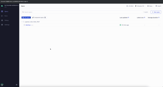
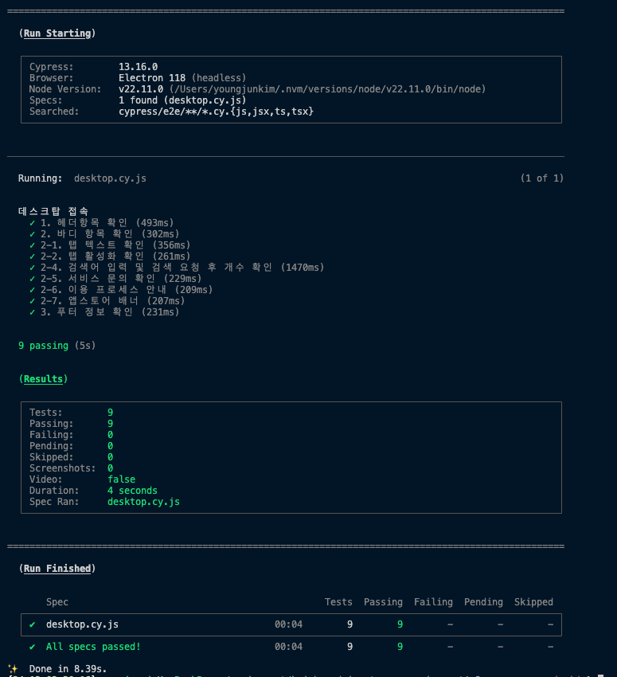

### 목차

1. [프로젝트 소개](#1-프로젝트-소개)
2. [사용된 기술 스택](#2-사용된-기술-스택)
3. [프로젝트 구성 과정](#3-프로젝트-구성-과정)
4. [주요 구현 사항](#4-주요-구현-사항)
5. [구현 화면 및 영상](#5-구현-화면-및-영상)
6. [프로젝트 실행 방법](#6-프로젝트-실행-방법)
7. [작업 과정에서의 느낀점](#7-작업-과정에서의-느낀점)

## 1. 프로젝트 소개

- `목표`: 위블비즈 (https://wiblebiz.kia.com/FAQ)의 화면을 본인이 작업한다는 가정 하에 최대한 비슷하게 제작
- 이 프로젝트는 위블비즈FAQ 홈페이지를 동일하게 구현하는 것으로, Vite를 기반으로 React(typescript) 프로젝트를 구성했습니다.

## 2. 사용된 기술 스택

- React
- Vite
- MSW (Mock Service Worker)
- React Query
- Zustand
- SCSS
- Axios
- Vitest
- Cypress

## 3. 프로젝트 구성 과정

1. 환경 설정

   - Vite를 사용하여 React(Typescript)프로젝트 환경 세팅.
   - MSW를 활용한 API Mock 서버 구축.

2. 상태 관리

   - 서버) React Query 를 사용하여 서버 데이터를 fetching 하도록 구현.
   - UI) zustand를 사용하여 클라이언트 사이드의 전역 스토어 관리 (검색, 모달 제어)

3. API 통신

   - React Query 내에서 axios를 활용하여 요청/응답 처리 구현

4. 반응형 UI

   - 모바일 및 데스크탑 환경에 최적화된 UI 구현.

5. 테스트 코드 작성

   - `/faq` API 를 호출하여 요청에 맞는 응답을 전달해줄 때, 올바르게 전달 되는지 확인합니다.

## 4. 주요 구현 사항.

- **반응형 UI**: 작은사이즈(743px이하) 에서도 정상적으로 보이는 UI를 구현하기 위해 반응형 CSS를 적용했습니다. 특히, 모바일 화면에서 헤더의 `햄버거 버튼` 구현이 까다로웠던 경험을 했습니다.
- **MSW**: API의 응답값을 mocking 하여 mock 서버를 구현했습니다. 특히 `/faq` API에서 검색어를 입력할 경우 그에 맞는 응답값만 줘야하는 상황에서 어떻게 응답을 전달할지 고민을 했습니다.
- **zustand**: 클라이언트 사이드에서 전역으로 관리할 변수를 zustand 를 이용하여 store로 관리 했습니다. 그로 인해 props drilling 을 피할 수 있었습니다.
- **vitest**: 서버 사이드의 계산 로직인 `searchMatchJsonList` 함수가 정상 작동하는지 확인할 수 있는 테스트 코드를 작성했습니다.
- **E2E 테스트**: E2E 테스트 도구인 `cypress`를 설치하여 최종적으로 만들어진 UI가 정상적으로 표현되는지(있어야 할 텍스트, 값) 확인하는 테스트 도구를 추가 하여 추후 유지보수 시 이전 달라진 텍스트를 detect 할 수 있어 안정성을 확보할 수 있습니다.

## 5. 구현 화면 및 영상

### 데스크탑 영상


### 모바일 영상


### 데스크탑 화면 캡처


### 모바일 화면 캡처


### Unit 테스트 코드 실행 화면


### E2E 테스트 실행화면 (너무 빠르게 지나가 보이지 않을 수 있습니다.)



- 위 영상은 Cypress를 통해 실행한 영상 입니다.



- 위 이미지는 Cypress를 CLI로 실행시켜 얻은 결과 입니다. 백그라운드에서 실행시킨뒤 테스트 결과를 확인합니다.

## 6. 프로젝트 실행 방법

- node version은 현재 LTS 버전인 **v22.11.0** 을 사용했습니다

1. 프로젝트 클론

```bash
git clone https://github.com/kyj7337/kyj-hyundai-autoever-assignment
cd kyj-hyundai-autoever-assignment
```

2. 패키지 설치

```bash
yarn 혹은 (npm install)
```

3. 프로젝트 실행

```bash
yarn dev 혹은 (npm run dev)

/* 해당 명령어 실행이후 localhost:3000 으로 서버가 실행되며, 브라우저가 열립니다 ^^ */
```

4. (번외) E2E 테스트 실행 방법

- 터미널을 2개 준비합니다.

**터미널1**

```bash
yarn dev
```

**터미널2**

```bash
yarn cypress 혹은 (yarn cypress:run)
```

이후 등장한 cypress 브라우저에서 E2E testing 을 진행할 수 있습니다.

## 7. 작업 과정에서의 느낀점

(개발 관점)

- MSW를 새롭게 구축하며 어떤 요청과 응답을 구현해야 할지 고민했습니다. 파라미터로 question 을 넣고 호출할 경우 서버에서 어떻게 필터링 할지 고민했었습니다.
- 반응형 UI를 구현하며, 모바일 화면에서 메뉴가 사라진 상황에서 햄버거 버튼이 생겼고, 애니메이션이 적용된 화면을 구현할 때 여러 고민을 했었습니다.
- 최대한 기존화면과 비슷하게 개발하기 위해, 기존화면에서 사용된 변수 일부를 복사하여 사용했습니다.
- E2E 테스트를 추가하여 추후 유지보수를 하게 될 경우 기존과 얼마나 어떻게 변경되었는지 알 수 있고, UI 및 텍스트가 어떻게 변경되었는지 체크하여 사이드 이펙트를 방지할 수 있는 환경을 구성하여 서비스를 안정적으로 개발을 할 수 있습니다.

(서비스 관점)

- 본 프로젝트를 개발하면서 위블비즈 서비스를 보고, 현대 오토에버의 서비스 영역이 넓고 다양한지를 새롭게 깨달았습니다. 넓은 서비스 영역은 새로운 도전과 성장의 기회가 될 것이라는 생각에 설렜습니다.
