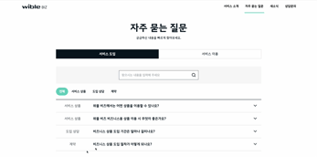
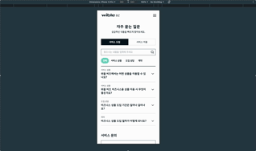
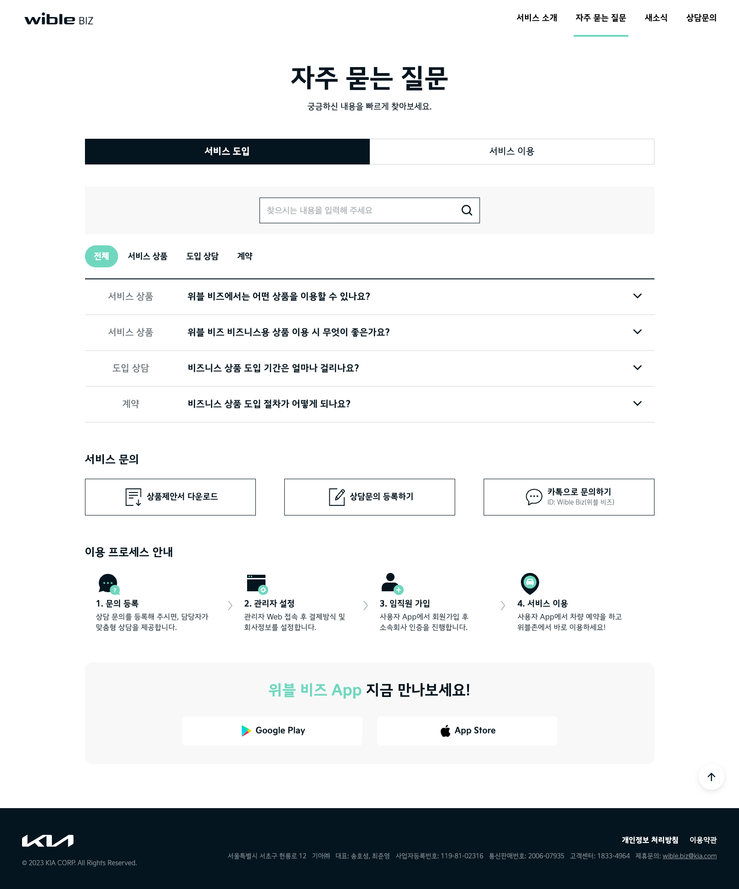
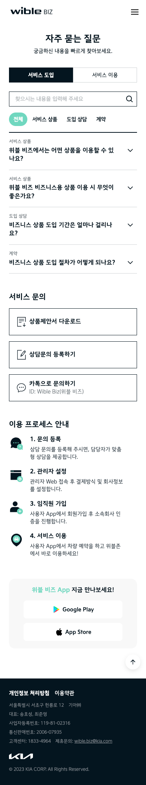
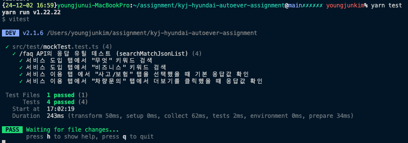

## 1. 프로젝트 소개

- `목표`: 위블비즈 (https://wiblebiz.kia.com/FAQ)의 화면을 본인이 작업한다는 가정 하에 최대한 비슷하게 제작
- 이 프로젝트는 위블비즈FAQ 홈페이지를 동일하게 구현하는 것으로, Vite를 기반으로 React(typescript) 프로젝트를 구성했습니다.

## 사용된 기술 스택

- React
- Vite
- MSW (Mock Service Worker)
- React Query
- Zustand
- SCSS
- Axios
- Vitest

## 프로젝트 구성 과정

1. 환경 설정

   - Vite를 사용하여 React(Typescript)프로젝트 환경 세팅.
   - MSW를 활용한 API Mock 서버 구축.

2. 상태 관리

   - 서버) React Query 를 사용하여 서버 데이터를 fetching 하도록 구현.
   - UI) zustand를 사용하여 클라이언트 사이드의 전역 스토어 관리 (검색, 모달 제어)

3. API 통신

   - React Query 내에서 axios를 활용하여 요청/응답 처리 구현

4. 반응형 UI

   - 모바일 및 데스크탑 환경에 최적화된 UI 구현.

5. 테스트 코드 작성

   - `/faq` API 를 호출하여 요청에 맞는 응답을 전달해줄 때, 올바르게 전달 되는지 확인합니다.

## 주요 구현 사항.

- **반응형 UI**: 작은사이즈(743px이하) 에서도 정상적으로 보이는 UI를 구현하기 위해 반응형 CSS를 적용했습니다. 특히, 모바일 화면에서 헤더의 `햄버거 버튼` 구현이 까다로웠던 경험을 했습니다.
- **MSW**: API의 응답값을 mocking 하여 mock 서버를 구현했습니다. 특히 `/faq` API에서 검색어를 입력할 경우 그에 맞는 응답값만 줘야하는 상황에서 어떻게 응답을 전달할지 고민을 했습니다.
- **zustand**: 클라이언트 사이드에서 전역으로 관리할 변수를 zustand 를 이용하여 store로 관리 했습니다. 그로 인해 props drilling 을 피할 수 있었습니다.
- **vitest**: 서버 사이드의 계산 로직인 `searchMatchJsonList` 함수가 정상 작동하는지 확인할 수 있는 테스트 코드를 작성했습니다.

## 구현 화면 및 영상

### 데스크탑 영상



### 모바일 영상



### 데스크탑 화면 캡처



### 모바일 화면 캡처



### 테스트 코드 실행 화면



## 프로젝트 실행 방법

- node version은 현재 LTS 버전인 **v22.11.0** 을 사용했습니다

1. 프로젝트 클론

```bash
git clone https://github.com/kyj7337/kyj-hyundai-autoever-assignment
cd kyj-hyundai-autoever-assignment
```

2. 패키지 설치

```bash
yarn 혹은 (npm install)
```

3. 프로젝트 실행

```bash
yarn dev 혹은 (npm run dev)

/* 해당 명령어 실행이후 localhost:3000 으로 서버가 실행되며, 브라우저가 열립니다 ^^ */
```

## 작업 과정에서의 느낀점

- MSW를 새롭게 구축하며 어떤 요청과 응답을 구현해야 할지 고민했습니다. 파라미터로 question 을 넣고 호출할 경우 서버에서 어떻게 필터링 할지 고민했었습니다.
- 반응형 UI를 구현하며, 모바일 화면에서 메뉴가 사라진 상황에서 햄버거 버튼이 생겼고, 애니메이션이 적용된 화면을 구현할 때 여러 고민을 했었습니다.
- 최대한 기존화면과 비슷하게 개발하기 위해, 기존화면에서 사용된 변수 일부를 복사하여 사용했습니다.
